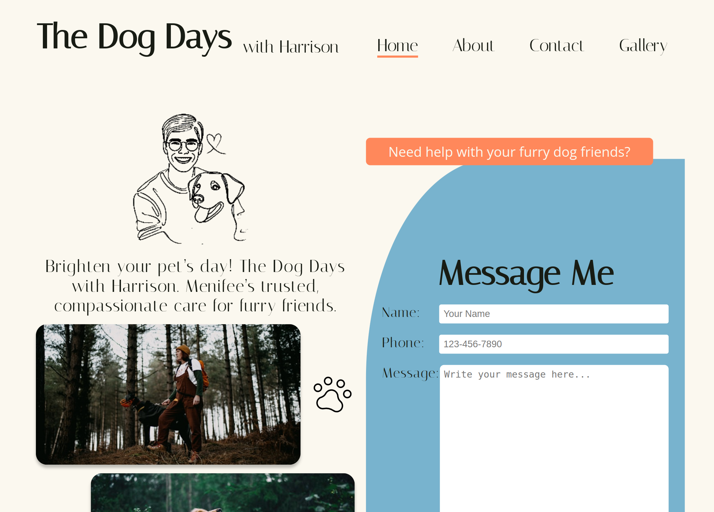
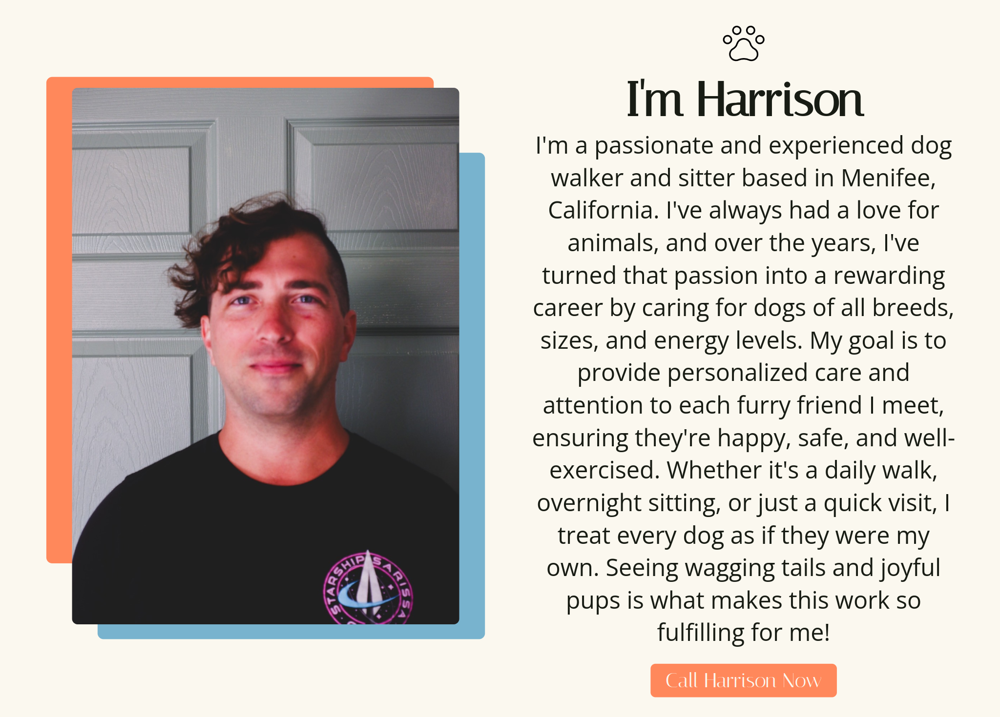
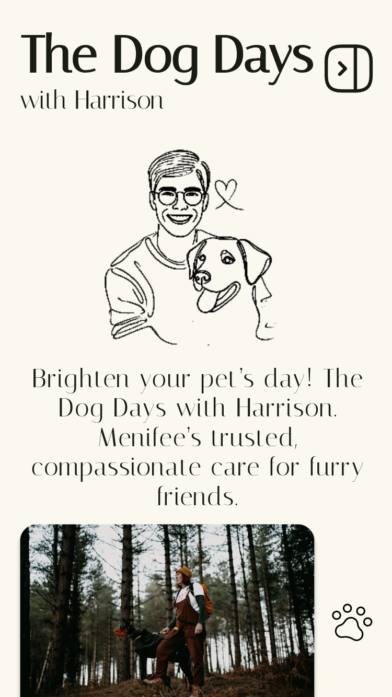
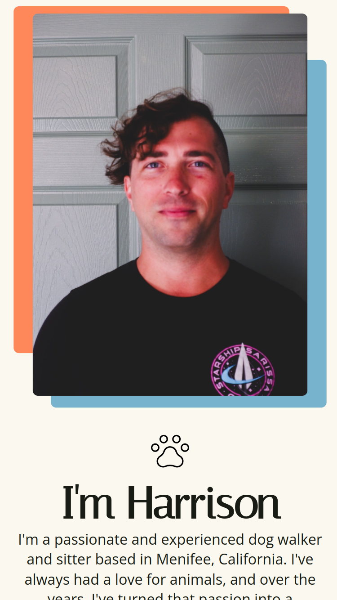

# The Dog Days 🐾

**Live Site:** [The Dog Days](https://the-dog-days.netlify.app/#/)

This is a website for **Harrison's dog walking, sitting, and visiting business** based in Menifee, California. Harrison is a sole proprietor who currently works with several families. The purpose of the site is to provide essential information about Harrison and his services, allowing users to easily **call** or **email** him to request more information or schedule an appointment.

The site was meticulously built with **Vue.js**, **SCSS**, **Formspree**, and **Vite**, with a strong focus on **user experience (UX)** and a completely **custom UI**.

---

## Features

- **One-Touch Contact**: Users can quickly call or email Harrison directly from the site.
- **Custom UI Design**: Features hand-edited "one line drawings" provided by ChatGPT and prepared by me.
- **Responsive Design**: Designed to look and function beautifully on all devices, from mobile phones to large desktop screens.
- **Visually Appealing Gallery**: A custom grid-based layout showcases happy dogs and services provided.
- **Contact Form**: Integrated with Formspree, users can send messages to Harrison directly from the site.
- **Local SEO Optimization**: Carefully optimized to appear for searches like **"dog walker Menifee, CA"**.
- **Performance**: Built with Vite for fast, modern development and optimal performance.
- **Best UX Practices**: Designed with attention to usability, accessibility, and clean navigation.

---

## Screenshots

### Desktop

  
  

### Mobile

  
  

---

## Installation and Setup Instructions

This project is a static site and is **not intended to be cloned or run locally**. If you are interested in seeing the live version, visit:  
[The Dog Days](https://dev-jlagunas.github.io/dog-days/)

---

## Acknowledgements

- Thanks to [Vue.js](https://vuejs.org/) for the incredible framework.
- Thanks to [Formspree](https://formspree.io/) for making contact form integration seamless.
- Thanks to **ChatGPT** for the one line drawings, which I further edited and prepared.
- Thanks to anyone who takes the time to check out this project.
- Thanks to my wife for always letting me sit in front of the computer for countless hours.

---

## License

This project is licensed under the terms of the MIT License. See the [LICENSE](LICENSE) file for details.

---

## Contact

**Juan Lagunas** - [GitHub](https://github.com/dev-jLagunas)  
Email: dev.jlagunas@gmail.com

Feel free to reach out if you have questions or feedback about the project.
